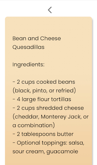

# We Got Food at Home!

### [Live Site](https://we-got-food-at-home.netlify.app/)

### [Figma Layout](https://www.figma.com/file/fPJsf2RvARy5zWy7LvlHYr/Food%40Home?node-id=92-475&t=dcNzCdV50c7E7YCK-0)

## 2023 Spring Hackathon hosted by General Assembly

Worked in a cross-functional team of UX designers and software engineers and pitched to a panel of industry experts. We created a gamification app that incentivizes users to cook at home instead of ordering out. The app rewards users with points and badges when they prepare meals at home. Users can input ingredients they have on hand and generate a recipe using OpenAI.

### Technologies used:

- **React:** Used to build the user interface and handle the front-end development.
- **OpenAI API:** Integrated to provide recipe recommendations and suggestions based on ingredients users have in on hand in their own kitchens.
- **Firebase:** Used as the back-end to store user data, manage authentication, and handle real-time updates.

  ### Key achievements:

- Designed and developed a functional app within a 4-day hackathon timeframe.
- Implemented a complex algorithm that recommends recipes based on items the user has on hand in their own kitchens.
- Created a user-friendly interface that encourages engagement and repeats usage.

### Skills gained:

- Experience with front-end development using React
  Knowledge of integrating OpenAI API and handling data with Firebase.
- Understanding of gamification principles and user engagement strategies.
- Collaborating with UX/UI designers and understanding the importance of their process.

## Engineers:

- [Adam Kaufman](https://github.com/akauf13)
- [Lauren Powers](https://github.com/laurenpowers20)
- [Suji Falcon](https://github.com/vvsuji)
- [Sarrthi Jasrotia](https://github.com/SarrthiJasrotia)

## UX/UI Designers:

- [Jacqueline Oberkrom](https://www.jacquelineoberkrom.com/)
- [Mikayla Salyer](https://www.mikaylasalyer.com/)
- [Robin Ong](https://www.robinong.com/)
